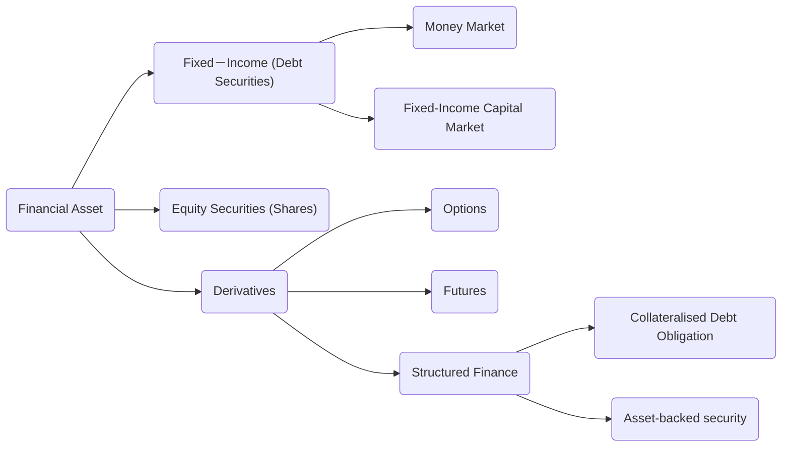
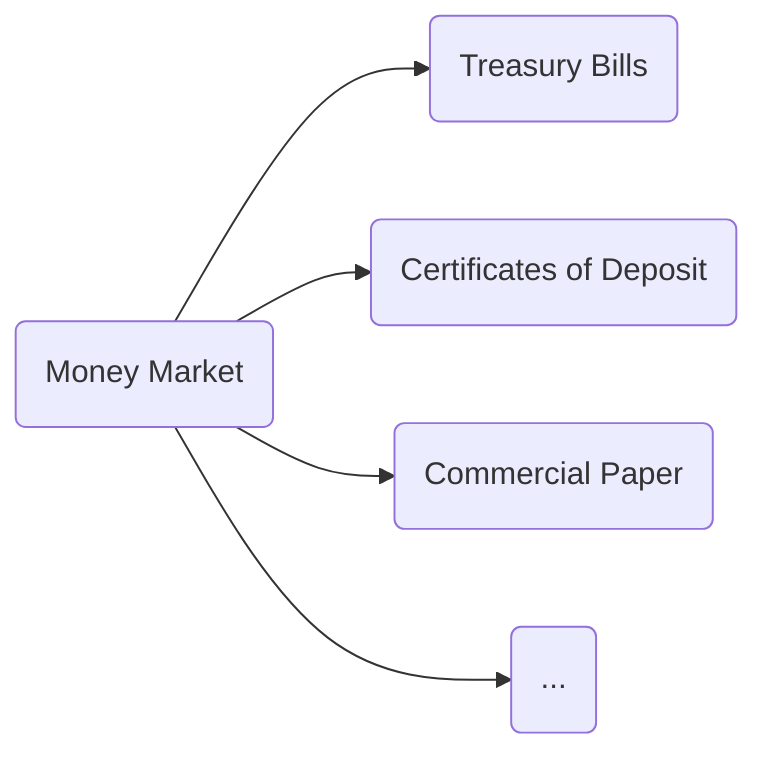

# Financial assets

## Money Market

Short-term debt securities (at most one year)

Liquid

Low risk

Often have large denominations

## Fixed-Income Capital Market

Longer term debt securities (1-30 years)

Examples
▶ Treasury Notes & Bonds
▶ Corporate Bonds
▶ International Bonds
▶ Municipal Bonds
▶ ...

Interest paid periodically (coupon payments)

Semiannual payments

Sold at auction (like bills)

### Bond Pricing

$$
P_B=\sum_{t=1}^T\frac{C_t}{(1+r)^t}+\frac{\text{Face Value}}{(1+r)^T},
$$

where

$P_B$: Price of the bond

$C_t$: Interest or coupon payments

$T$: Number of periods to maturity

$r$: Semi-annual discount rate or the semi-annual yield to maturity

**The yield (yield to maturity, 到期收益率)** of a bond is defined as the **interest rate at which the present value of the payment stream equals the bond price**

More example:

Zero-coupon bond (ZCB)

Perpetuity: A constant stream of identical cash fows with no end

# Equities

Common Stock

1. Ownership

2. Shares in a company confer voting rights at shareholders’ meetings, and a residual claim (剩余索取权) on assets

3. Shareholders receive earnings paid as dividends (股利) and potential capital gains (资本收益).

market capitalisation (市值): share price × shares outstanding

# Derivatives 金融衍生工具

Option, Future, Repurchase Agreement, etc.