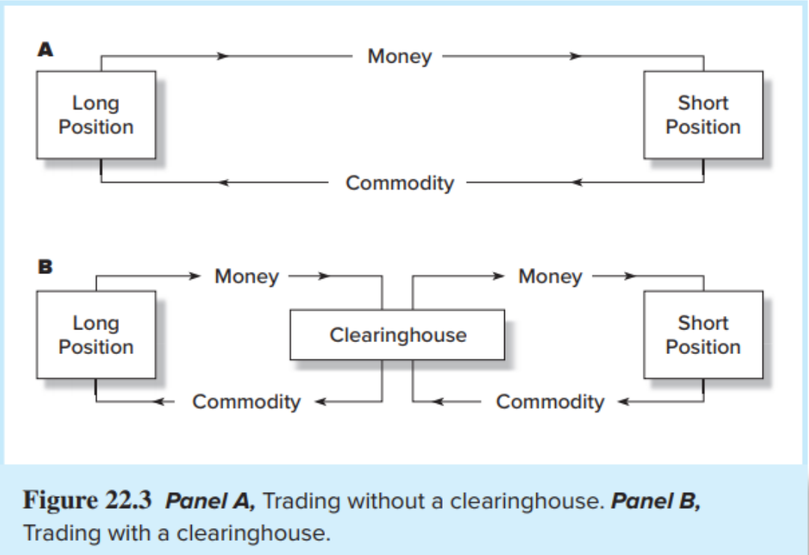

# Future

Future is an **obligation**, you can not just walk away when it's not profitable.

**Definition**

A futures contract (期货合约) calls for the delivery of an asset (or its cash value) at a specified (maturity) date at a specified (futures) price paid on the maturity date.

Two sides to contract:

- Long position (多头): a commitment (约定) to purchase the commodity on the delivery date.
- Short position (空头): a commitment to sell the commodity on the delivery date.

Profit to long is loss to short & vice versa

Long position is bullish; short bearish

| Option                               | Future                                                   |
| ------------------------------------ | -------------------------------------------------------- |
| Right to sell or buy                 | Obligation to make or take delivery                      |
| Exercised only when it is profitable | Long(short) position must buy(sell) at the futures price |
| must be purchased                    | Futures contracts are entered into without cost          |

Futures are traded on margin.

At the time the contract is entered into, no money changes hands.

## Trading Mechanics

Chicago Mercantile Exchange acts as a clearing house (清算所) and counterparty (对手方) to both sides of the trade

Open interest (未平头寸) is the number of contracts outstanding

The net position (净头寸) of the clearing house is zero

To exit from contract, enter opposite side

- If you are currently long, you simply instruct your broker to enter the short side of a contract to close out your position

Most futures contracts are closed out by reversing trades

Only 1-3% of contracts result in actual delivery of the underlying commodity

Both parties post margin (e.g. 10% of contract value)

- T-Bills may be used for this
  Profits recognized daily (marking to market, 盯市)
- Each day the profits or losses from the new futures price are paid over or subtracted from the account
  On day $t$, payment to long position $F_t −F_{t−1}$
- Sum of total adjustments (long position) is $F_T −F_0$
  If margin falls below maintenance level, investor gets a margin call

Convergence: As the expiration date of a futures contract approaches, the futures price (the agreed-upon price in the contract) and the spot price (the current market price) tend to move closer together until they are equal at the point of contract maturity. This phenomenon is known as convergence. Otherwise there's an arbitrage opportunity.

Why buy/sell futures?

Two motives: hedging (对冲) and speculation (投机)

Spot-futures parity theorem (现货-期货平价定理) – two ways to acquire an asset for some date in the future:

1. Purchase it now and store it
2. Take a long position in futures

These two strategies must have the same market determined costs

With a perfect hedge, the futures payoff is certain – there is no risk

A perfect hedge should earn the riskless rate of return

## Spot-Future Parity

Consider buy a thing and enter short position.

|                       | Now      | $T=1$ years after |
| --------------------- | -------- | ------------------- |
| buy                   | $-S_0$ | $S_T+D$           |
| short future position | 0        | $F_0-S_T$         |
| total                 | $-S_0$ | $F_0+D$           |

This is risk-free so

$$
\frac{F_0+D-S_0}{S_0}=r_f.
$$

The general version of spot-futures parity is

$$
D=S_0(1+d)^T-S_0\\
\ \\
F_0 = S_0(1+r_f −d)^T
$$

where $r_f$ is the annual risk-free rate, and $d$ is the annual dividend yield.

So any change in the spot price must be matched by a change in the futures price

If this is violated, you can **index arbitrage**

Exp: If the futures price is too low, go long futures, short the stock and invest the proceeds at the risk free rate

|                     | Now      | Afterwards             |
| ------------------- | -------- | ---------------------- |
| enter long position | 0        | $S_T-F_0$            |
| short stock         | $S_0$  | $-S_T$               |
| invest risk-free    | $-S_0$ | $S_0(1+r_f-d)^T$     |
| total               | 0        | $S_0(1+r_f-d)^T-F_0$ |
