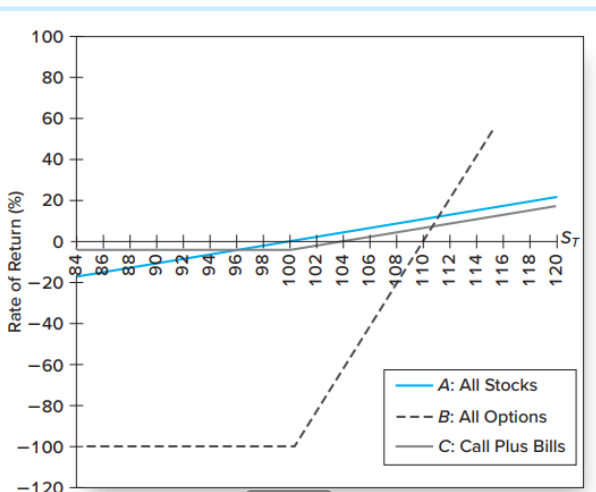

# Option

**Definition**

Option confers a **right**, not an **obligation** to its holder. The obligation is to the **seller**.

---

**Property**

If **immediate exercise** is profitable, then the option is **in-the-money**.

Else if the strike price of the option is equal to the current market price of the underlying asset, it's **"at-the-money"**.

Otherwise, it's **out-of-the-money**.

---

An American option (美式期权) allows it holder to exercise the right **on or before** the expiration date.

An European option (欧式期权) allows it holder to exercise the right only **on** the expiration date.

Most stocks and exchange-traded funds have American-style options while equity indices (e.g. the S&P 500) have European-style options.

We consider European option in this lecture.

## Call Options

**Definition**

Call Option (看涨期权) gives holder the right to purchase an asset at specified (exercise/strike) price (行使价格) on or before a specified (expiration/maturity) date.

Writing a call can be very risky, because you can lose ad infinitum. While the buyer of a call option can lose $C$ (premium) at most.

## Put Options

**Definition**

Put Option (看跌期权) gives holder the right to **sell** an asset at specified (exercise/strike) price on or before a specified (expiration/maturity) date

## Option Strategy

Options are often part of an overall strategy.

### Covered Call (抛补看涨期权)

Buy shares and write call options.

|                  | Now       | After$S_T>X$ | After$S_T<X$ |
| ---------------- | --------- | -------------- | -------------- |
| Buy share        | $-S_0$  | $S_T$        | $S_T$        |
| Sell call option | $C$     | $X-S_T$      | $0$          |
| Total            | $C-S_0$ | $X$          | $S_T$        |

Call written is said to be “covered”

- less risky than writing uncovered or “naked" calls

### Protective Put (保护看跌期权)

- Buy shares and buy put options
- Why do this?

## Pricing

Option pricing is based on **principle of replication: two strategies with identical payoffs in every state must cost the same to set up**

Also known as **Law of One Price (一价法则, LOOP)**

Otherwise there exits arbitrage opportunity

This idea underlies the Put-Call Parity Theorem (期权平价定理)

This tells us relationship between put and call price when both options have same expiration date and strike price

So if we can figure out how to price the call, price of the put can be determined by the relationship

No need for independent theories of put and call pricing

How do we get a relationship between put and call prices?

Key idea: construct two strategies with identical payoffs in every contingency

One involving put options and the other call options (same strike price and expiration date)

Which strategies?

- Protective Put
- Call-plus-Bills (buy call option and T-bills with face value equal to strike price and maturity date equal to expiration date of options)

The left-side is the cost of setting up a Protective-Put portfolio.

The right-side is the cost of setting up a Call-plus-Bills portfolio.

By making the cost of these equal we get

$$
S_0+P=C+\frac {X+D}{(1+r_f)^T},
$$

where

$X$ is the strike price,

$r_f$ is the annual risk-free rate,

$T$ is the time until maturity in year,

$C$ is the premium for call option,

$S_0$ is the initial share price,

$P$ is the premium for put option,

$D$ is the dividend paid.

All components of the formula are observable.

If it's violated, there is an arbitrage opportunity.

### Call Pricing

How low or high can call premium $C$ be?

Must be below $S_0$ since stock payoff is above option payoff in all contingencies

|               | $S_T<X$ | $S_T>X$ |
| ------------- | --------- | --------- |
| option payoff | $0$     | $S_T-X$ |
| stock payoff  | $S_T$   | $S_T$   |

We know that

$$
S_0 −X < C < S_0
$$

$C$ is the payoff of selling an option, the $S_0-X$ is the payoff of immediate exercising.

Consider two strategies:

- Call option: strike price X, time to expiration T
- Leveraged equity: borrow $X/(1+r_f)^T$, buy share at $S_0$

|                         | $S_T<X$ | $S_T>X$ |
| ----------------------- | --------- | --------- |
| option payoff           | $0$     | $S_T-X$ |
| leveraged equity payoff | $S_T-X$ | $S_T-X$ |

So $C$ should be higher than $X/(1+r_f)^T$, otherwise there's an arbitrage opportunity (short leveraged equity to buy option)

Since take any moment as $0$ time, we have $C>S_0-X$ so American options won't be exercised early. Left is the payoff of selling an option, the right is the payoff of immediate exercising.

American put option may be exercised early.

> 比如说执行价格为100元，股票价格为0，马上执行可以赚一百，但股票不能跌于0了，所以赚不可能超过100，所以就提前行使 thus avoiding lose the time value of money.

Or you can simply use risk-neutral probability

Risk neutral probability

$$
q=\frac{R-d}{u-d},
$$

where $R=(1+r_f)^T$.

Then
$$
p = \frac{qp_h+(1-q)p_l} R
$$

## Why buy options (instead of just shares)?

Options for Speculation(投机) (B):

Options can be used to take leveraged positions in the stock market. This means that investors can control a large amount of stock with a relatively small investment by using options.

Options for Risk Reduction (C):

Options can also be used as a risk management tool. Specifically, combining options with other assets can help to hedge against downside risk.

Some questions:

- Why write options?
- Why do out-of-the-money options have value?
